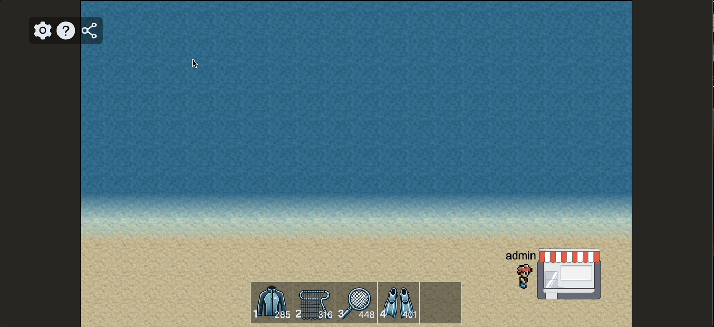
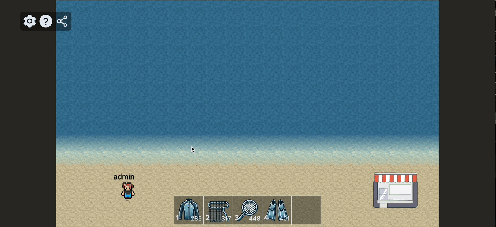
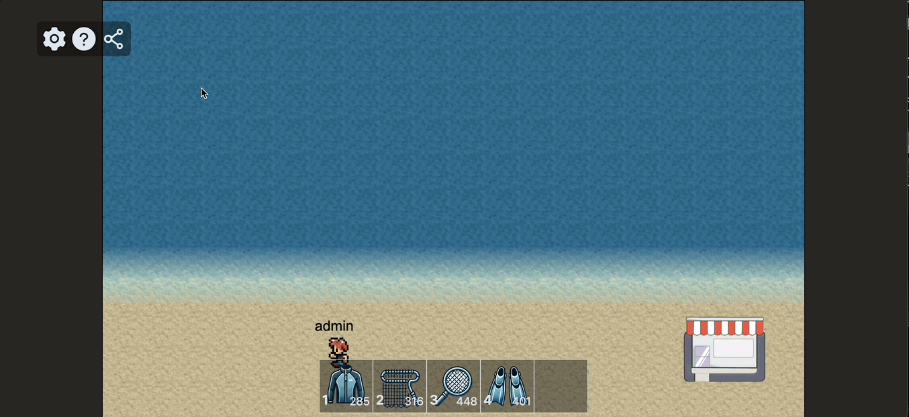
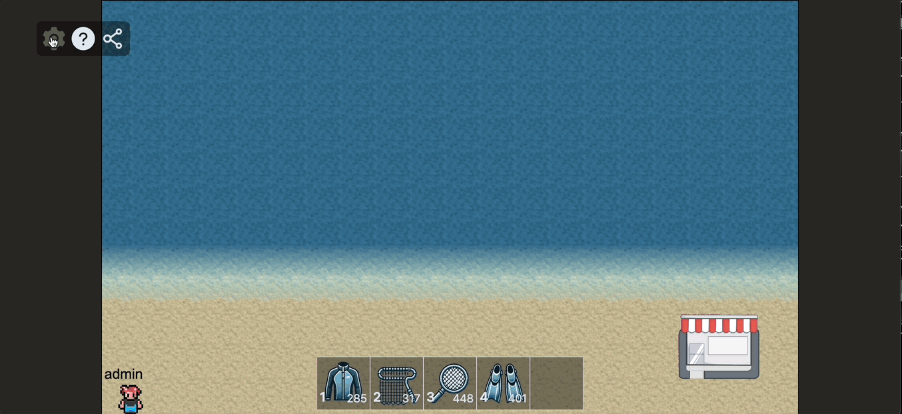
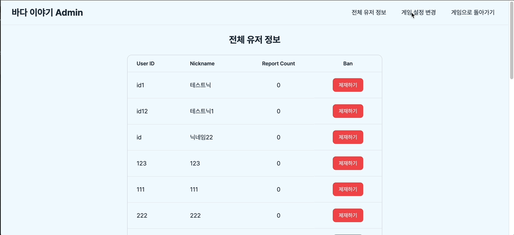

[](https://classroom.github.com/a/_GmLK7qi)

---

# 프로젝트 바다이야기

해양 쓰레기의 심각성을 알리기 위한 Serious game 제작

> 팀원: **송명섭(BE)**, **전성훈(BE)**, **최현성(FE)**, **이르판**

---

## 기술 스택

### Front-End

- **코어**: `Vite`, `React`, `TypeScript`, `Yarn`, `React-Router`
- **게임 요소 관리 / 렌더링**: `pixi.js`, `@pixi/react`
- **스타일링**: `tailwindCSS`, `postcss`, `autoprefixer`
- **통신**: `axios`, `socket.io-client`
- **전역 상태관리**: `zustand`
- **기타 라이브러리**: `date-fns`, `react-icons`
- **코드 품질 관리**: `eslint`, `prettier`

### **Back-End**

- **코어**: `Express`, `JavaScript`, `npm`
- **데이터베이스**: `MongoDB`, `Redis`
- **객체ID생성**: `uuid`
- **코드 품질 관리**: `prettier`

---

## 프로젝트 소개

### 1. 접속 화면


랜딩 페이지 입니다. 우측 하단 로그인, 회원가입 버튼을 눌러 로그인과 회원가입을 수행할 수 있습니다.


회원가입 시에는 닉네임 중복과 아이디 중복 여부를 체크해야 합니다. 모두 통과하지 못하면 회원가입이 불가능합니다.

### 2. 게임 페이지


회원가입 및 로그인에 성공하면 게임 페이지로 이동합니다. 최초 접속 시 튜토리얼 모달창이 열리고, 이후부터는 좌상단 ?를 클릭해서 읽어볼 수 있습니다.

키보드 방향키를 통해 캐릭터를 이동시킬 수 있고, 숫자 1~5키를 통해 획득/구매한 아이템을 사용할 수 있습니다.

해양으로 이동하면 소켓 룸에 입장하며 여러 플레이어들과 함께 쓰레기를 수집할 수 있습니다.

해양에서는 쓰레기와 함께 간혹 아이템, 상어, 해파리 등이 등장합니다. 아이템을 수집해 사용할 수 있고, 상어와 해파리를 피해야 합니다. 상어와 해파리는 1초동안 경고한 뒤 등장합니다.

아이템은 수집 사거리가 증가하거나, 이동속도가 빨라지는 효과를 가지고 있습니다.

소켓 룸 내 함께 플레이하고 있는 유저들의 쓰레기 수집량 Top5를 보여주는 순위 컴포넌트가 우상단에 존재합니다. 실시간으로 업데이트되는 순위를 통해 승부욕을 자극합니다.

해변으로 이동하면 소켓 룸에서 나가집니다.

우측 하단의 상점으로 다가가 스페이스바를 누르면 상점 모달창이 열립니다. 상점에서는 수집한 쓰레기를 재화로 환전할 수 있고, 이 재화로 아이템을 구매하거나 판매할 수 있습니다.



상점에서 쓰레기를 환전하거나, 아이템을 구매/판매할 수 있습니다.



게임 내에는 `WebAudio API`를 활용한 효과음이 적용되어 있습니다. 좌상단 설정 버튼을 누르면 열리는 모달창에서 이 효과음의 볼륨을 조절할 수 있습니다. 볼륨 크기는 `localstorage`에 저장되어 재접속 해도 유지됩니다.

추가로 로그아웃과, 관리자 계정의 경우 관리자 페이지로 이동할 수 있는 버튼들이 존재합니다.



해양에서 부적절한 행위를 한 플레이어를 클릭한 뒤, 신고 사유를 입력하면 신고할 수 있습니다.

### 3. 관리자 페이지



관리자는 관리자 페이지에서 모든 유저들의 정보를 볼 수 있고, 특정 유저를 제재할 수 있습니다.



관리자는 관리자 페이지에서 쓰레기의 생성 속도와 최대치를 조절할 수 있습니다.

새로운 쓰레기 생성 속도와 최대치를 설정하면, `Redis`의 `Pub-Sub`을 활용해 이전 `setinterval`을 `clear`하고, 새로운 `setinterval`을 생성하는 클로저를 활용해 구현했습니다.

---

## 프로젝트 디렉토리 구조

### Front-End

```
src
 ┣ apis
 ┃ ┣ adminRestful.ts
 ┃ ┣ currencyRestful.ts
 ┃ ┣ itemRestful.ts
 ┃ ┣ storeRestful.ts
 ┃ ┗ userRestful.ts
 ┣ components
 ┃ ┣ admin
 ┃ ┃ ┣ AdminHeader.tsx
 ┃ ┃ ┣ BanModal.tsx
 ┃ ┃ ┣ EditSetting.tsx
 ┃ ┃ ┗ ViewUsers.tsx
 ┃ ┣ common
 ┃ ┃ ┣ Loading.tsx
 ┃ ┃ ┗ ToastModal.tsx
 ┃ ┣ game
 ┃ ┃ ┣ modal
 ┃ ┃ ┃ ┣ PlayerReportModal.tsx
 ┃ ┃ ┃ ┣ SettingModal.tsx
 ┃ ┃ ┃ ┣ ShareModal.tsx
 ┃ ┃ ┃ ┣ StoreModal.tsx
 ┃ ┃ ┃ ┗ TutorialModal.tsx
 ┃ ┃ ┣ render
 ┃ ┃ ┃ ┣ RenderAnotherPlayer.tsx
 ┃ ┃ ┃ ┣ RenderGame.tsx
 ┃ ┃ ┃ ┣ RenderItem.tsx
 ┃ ┃ ┃ ┣ RenderMap.tsx
 ┃ ┃ ┃ ┣ RenderObstacle.tsx
 ┃ ┃ ┃ ┣ RenderPlayer.tsx
 ┃ ┃ ┃ ┣ RenderTrash.tsx
 ┃ ┃ ┃ ┗ RenderWarning.tsx
 ┃ ┃ ┗ ui
 ┃ ┃ ┃ ┣ ItemInventory.tsx
 ┃ ┃ ┃ ┣ LeaderBoard.tsx
 ┃ ┃ ┃ ┗ SideButton.tsx
 ┃ ┗ landing
 ┃ ┃ ┣ LoginModal.tsx
 ┃ ┃ ┗ RegisterModal.tsx
 ┣ constants
 ┃ ┣ game.ts
 ┃ ┗ tutorial.ts
 ┣ hooks
 ┃ ┣ admin
 ┃ ┃ ┣ useUsersData.ts
 ┃ ┃ ┗ useValidateAdmin.ts
 ┃ ┣ game
 ┃ ┃ ┣ useAudio.ts
 ┃ ┃ ┣ useCheckLogin.ts
 ┃ ┃ ┣ useItemStore.ts
 ┃ ┃ ┣ useKeyListener.ts
 ┃ ┃ ┣ usePlayerAnimation.ts
 ┃ ┃ ┣ usePlayerPos.ts
 ┃ ┃ ┣ useSocket.ts
 ┃ ┃ ┣ useSocketRecv.ts
 ┃ ┃ ┗ useStageInit.ts
 ┃ ┗ landing
 ┃ ┃ ┗ useInputCheck.ts
 ┣ pages
 ┃ ┣ AdminPage.tsx
 ┃ ┣ GamePage.tsx
 ┃ ┗ LandingPage.tsx
 ┣ router
 ┃ ┗ Router.tsx
 ┣ store
 ┃ ┣ gameDataStore.ts
 ┃ ┣ keyStore.ts
 ┃ ┣ modalStore.ts
 ┃ ┣ playerInfoStore.ts
 ┃ ┣ playerStore.ts
 ┃ ┣ toastStore.ts
 ┃ ┗ volumeStore.ts
 ┣ types
 ┃ ┣ GameType.ts
 ┃ ┣ ModalType.ts
 ┃ ┣ PlayerType.ts
 ┃ ┣ StoreType.ts
 ┃ ┣ adminType.ts
 ┃ ┣ currencyType.ts
 ┃ ┣ itemsType.ts
 ┃ ┣ obstacleType.ts
 ┃ ┣ registerTypes.ts
 ┃ ┗ trashType.ts
 ┣ utils
 ┃ ┣ isCollidingStore.ts
 ┃ ┣ isKeyActive.ts
 ┃ ┗ localStorage.ts
 ┣ index.css
 ┣ main.tsx
 ┗ vite-env.d.ts
```

### Back-End

```
backend
 ┣ config
 ┃ ┣ constant.js
 ┃ ┗ db.js
 ┣ controllers
 ┃ ┣ adminController.js
 ┃ ┣ coinController.js
 ┃ ┣ gameController.js
 ┃ ┣ itemController.js
 ┃ ┣ storeController.js
 ┃ ┗ userController.js
 ┣ middlewares
 ┃ ┣ adminMiddleware.js
 ┃ ┣ authMiddleware.js
 ┃ ┗ validateApiKey.js
 ┣ models
 ┃ ┣ ban.js
 ┃ ┣ inventory.js
 ┃ ┣ item.js
 ┃ ┣ obstacle.js
 ┃ ┣ report.js
 ┃ ┣ trash.js
 ┃ ┗ user.js
 ┣ routes
 ┃ ┣ adminRoutes.js
 ┃ ┣ coinRoutes.js
 ┃ ┣ gameRoutes.js
 ┃ ┣ itemRoutes.js
 ┃ ┣ storeRoutes.js
 ┃ ┗ userRoutes.js
 ┣ sockets
 ┃ ┣ eventHandler
 ┃ ┃ ┣ gameEvent.js
 ┃ ┃ ┣ leaderboard.js
 ┃ ┃ ┣ manageGameRoom.js
 ┃ ┃ ┣ playerMove.js
 ┃ ┃ ┗ playerStatus.js
 ┃ ┗ socketHandler.js
 ┣ utils
 ┃ ┣ gameUtils.js
 ┃ ┣ makeLeaderBoard.js
 ┃ ┗ redisHandler.js
 ┣ utils2
 ┃ ┣ itemUtils.js
 ┃ ┣ obstacleUtils.js
 ┃ ┣ trashUtils.js
 ┃ ┗ userUtils.js
 ┣ .env
 ┣ .prettierrc
 ┣ package-lock.json
 ┣ package.json
 ┗ server.js
```

---
